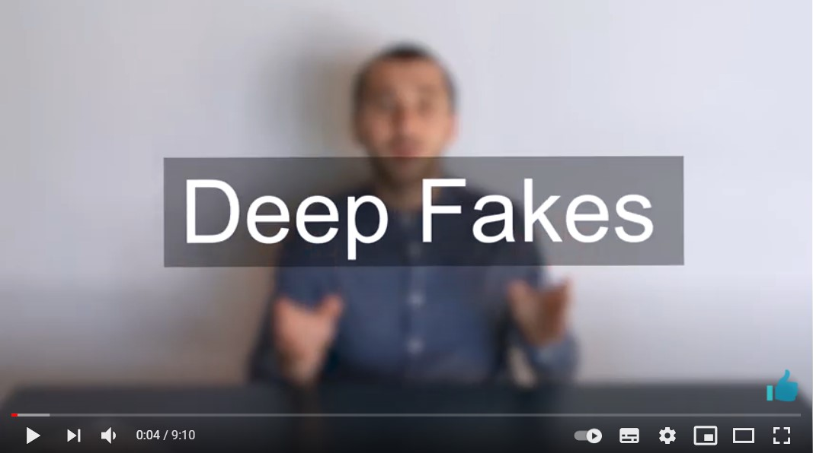
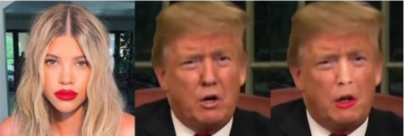
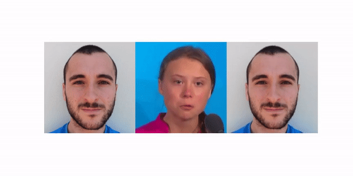

<h1 align="center">Deepfakes: Introduction and Latest Implementation</h1>
<h4 align="center"> This research aims to introduce deep fakes,
presenting the state of the art implementations in the area and examples of what such technology is capable of doing. </h4>

  
  

## Abstract

Deep Learning algorithms are being used in several fields nowadays, such as Self-driving
cars, Healthcare or Voice-Activated Assistants. Programs developed with these algorithms are
getting easier for not experienced users to use and their features are constantly growing. Despite
this being positive for contributing to previous sectors, deep learning-powered applications that
could cause threats in politics, privacy and security are being developed too. An example of this
is the so-called "deep fakes". This research has the goal of introducing this type of algorithms,
showing state-of-the-art implementations in the area and examples of what this technology is
capable of.

Below is presented a summary of the actual research, the full paper can be found at [Deepfakes: Introduction and Latest Implementation](docs/deepfakes_general.pdf) or [Deepfakes: Introduction and Applications in Digital Health](docs/deepfakes_digital_health.pdf) for a more focused report on Digital Health. Also, here is a video summarizing the research presented, in case you prefer the visual to the textual 😄

<a href="https://youtu.be/pMBDYBeo8cE" alt="Watch the video" target="_blank">

</a>

## Introduction

Deepfake is a deep learning technique used to create convincing image, audio and video hoaxes.
The most common application is to swap a person in an existing image or video with another one,
generating a fake synthetic media. The difference with traditional techniques such as Photoshop
is that deepfakes consists of powerful techniques for generating visual or audio content with high
potential to deceive. Some of the popular areas where these algorithms are used are fake news,
financial fraud, revenge porn and celebrity pornographic videos. As these are critical areas, most of
the academic research surrounding Deepfake seeks to detect this content [10]. Later some techniques
for deepfake detection will be presented. According to the legal response, some countries have been
introducing legislation to tackle deepfake content. For instance, in the United States, some states
such as California, Texas and New York have introduced "The Malicious Deep Fake Prohibition
Act", which will make a federal crime to create or distribute a deepfake when doing so will facilitate
illegal conduct [4].

The technology used by deepfakes algorithms includes previous techniques such as autoencoders
and generative adversarial networks. A drawback in these algorithms would be the high quantity
of data needed to train models to create realistic synthetic content. For this reason, most of the
initial targets for the deepfakes are public celebrities or politicians, which have a large number of
videos and images available online. However, these techniques are improving significantly over time
and there are some techniques available to generate deepfake content with few images, through an
approach called few shot learning.

The first deepfake video was produced in 2017 where a popular face was swapped in pornographic
content and published on Reddit. In 2018, the famous website banned this type of content classified
as fake porn, which was followed by Twitter or Gfycat [6]. On top of that, these algorithms can be
used to threaten the national security of an entire country, for instance publishing a video of the
president of the United States giving a fake speech [14], which could affect election campaigns or
military actions. It could be used as part of social engineering scams through the branch of audio
deepfakes, fooling people into thinking they are receiving instructions from a trusted source. In
2019, a UK energy firm CEO was scammed $243, 000 when he was ordered by a supposed chief
executive from the parent’s company to transfer the money to a Hungarian bank [5].

Despite all these dark applications of deepfake, there are many positive ones such as creating
voices for those who have lost theirs, recording the same character in a film through different ages,
such as in the Netflix film ’The Irishman’ [16] or updating episodes in movies without shooting
them again [11].

## Deepfake Tools and Demo

Nowadays there exist multiple open source projects to generate deepfakes that any user with no additional experience in the field could use. After researching the state-of-the-art ones, they have been
represented in table 1. The purpose of this list is to enhance efforts into research and development
of deepfakes and their detection and not to support the creation of nefarious content.

| Name                                         | Description                                                                                                                                               | Link                                                        |
| -------------------------------------------- | --------------------------------------------------------------------------------------------------------------------------------------------------------- | ----------------------------------------------------------- |
| DeepFaceLab                                  | - Leading software for generating deepfakes.   - It contains advance techniques and workflow so that the users can achieve more professional results. | https://github.com/iperov/DeepFaceLab                       |
| FaceSwap                                     | - Tool that utilizes deep learning to recognizeand swap faces in pictures and videos.                                                                     | https://github.com/deepfakes/faceswap                       |
| DFaker                                       | - A generator of larger resolution facesmasked, weirdly warped, deepfakes.                                                                                | https://github.com/dfaker/df                                |
| First Order Motion Model for Image Animation | - Applicate the animation of a drivingvideo to a unique source image.   - Included Demo with Google Colab and Python.                                 | https://github.com/AliaksandrSiarohin/first-order-model     |
| Motion Supervised co-part Segmentation       | - Self-supervised deep learning method for co-part segmentation.   - Included Demo with Google Colab and Python.                                      | https://github.com/AliaksandrSiarohin/motion-cosegmentation |
| Disrupting Deepfakes                         | - Tool to disrupt deep fake creationon conditional image translation networks.                                                                            | https://github.com/natanielruiz/disrupting-deepfakes        |

Regarding face swapping, by using the Google Colab demo from the repository Motion Supervised co-part Segmentation [8], the results represented in the figure below were generated. The first
result was produced through unsupervised segmentation, while the second one was formed using
supervised part-swaps.

 

On top of that, below are displayed some examples from the First Order Motion
Model for Image Animation Demo [13]. It was made in Google Colab modifying the original version
of the demo and generating deepfakes with a picture of myself as the source image. It was tested
in different driving videos, two of them represented in the figure.

## Conclusions

The current state in deepfakes is complicated. Every time a new deepfake technology is released,
users will try to develop a technology to detect the images generated with that technology, and
then hackers would try to bypass that detection and ideate a new approach for generating them,
and this will continue with a virus/anti-virus dynamic. On top of that, despite achieving high
accuracy in deepfake detection, for instance, 99%, sometimes that 1% of no detected deepfakes
could compromise users of platforms such as Instagram or Twitter.

Another idea in the area for tackling this issue is to use programs that can automatically watermark and identify
images taken on cameras or implementing blockchain technology to verify content from trusted sources [15].
However, the likely future is that none of these approaches would help ’solve’ this issue, it is an endless competition that can have very critical results in terms of privacy, safety and political concerns. People need to be aware of these technologies as well as verify
each source they read or watch. Besides, governments should take imminent measures for people
generating or sharing deepfakes for unethical uses.

## Author

  

## References

[1] Deep convolutional generative adversarial network : Tensorflow core.

[2] Agarwal, S., Farid, H., Gu, Y., He, M., Nagano, K., and Li, H. Protecting world
leaders against deep fakes. In Proceedings of the IEEE Conference on Computer Vision and
Pattern Recognition Workshops (2019), pp. 38–45.

[3] Badr, W. Auto-encoder: What is it? and what is it used for? (part 1), Jul 2019.

[4] Brown, N. I. Congress wants to solve deepfakes by 2020. that should worry us., Jul 2019.

[5] Damiani, J. A voice deepfake was used to scam a ceo out of $243,000, Sep 2019.

[6] Kelion, L. Reddit bans deepfake porn videos, Feb 2018.

[7] Korshunov, P., and Marcel, S. Vulnerability assessment and detection of deepfake videos.
In The 12th IAPR International Conference on Biometrics (ICB) (2019), pp. 1–6.

[8] Lathuilière, S., Tulyakov, S., Ricci, E., Sebe, N., et al. Motion-supervised co-part
segmentation. arXiv preprint arXiv:2004.03234 (2020).

[9] Li, Y., Chang, M.-C., and Lyu, S. In ictu oculi: Exposing ai created fake videos by
detecting eye blinking. In 2018 IEEE International Workshop on Information Forensics and
Security (WIFS) (2018), IEEE, pp. 1–7.

[10] Manke, K., and Manke, K. Researchers use facial quirks to unmask ’deepfakes’, Jun 2019.

[11] Marr, B. The best (and scariest) examples of ai-enabled deepfakes, Jul 2019.

[12] Nguyen, T. T., Nguyen, C. M., Nguyen, D. T., Nguyen, D. T., and Nahavandi, S.
Deep learning for deepfakes creation and detection. arXiv preprint arXiv:1909.11573 (2019).

[13] Siarohin, A., Lathuilière, S., Tulyakov, S., Ricci, E., and Sebe, N. First order
motion model for image animation. In Advances in Neural Information Processing Systems
32, H. Wallach, H. Larochelle, A. Beygelzimer, F. d'Alché-Buc, E. Fox, and R. Garnett, Eds.
Curran Associates, Inc., 2019, pp. 7137–7147.

[14] Suwajanakorn, S., Seitz, S. M., and Kemelmacher-Shlizerman, I. Synthesizing
obama: learning lip sync from audio. ACM Transactions on Graphics (TOG) 36, 4 (2017),
1–13.

[15] Vincent, J. Deepfake detection algorithms will never be enough, Jun 2019.

[16] Wood, C. A deepfake artist’s attempt to make robert de niro look younger in ’the irishman’
is being hailed as superior to netflix’s cgi, Jan 2020.

[17] Xuan, X., Peng, B., Wang, W., and Dong, J. On the generalization of gan image
forensics. In Chinese Conference on Biometric Recognition (2019), Springer, pp. 134–141.
8

[18] Zakharov, E., Shysheya, A., Burkov, E., and Lempitsky, V. Few-shot adversarial
learning of realistic neural talking head models. In Proceedings of the IEEE International
Conference on Computer Vision (2019), pp. 9459–9468.
